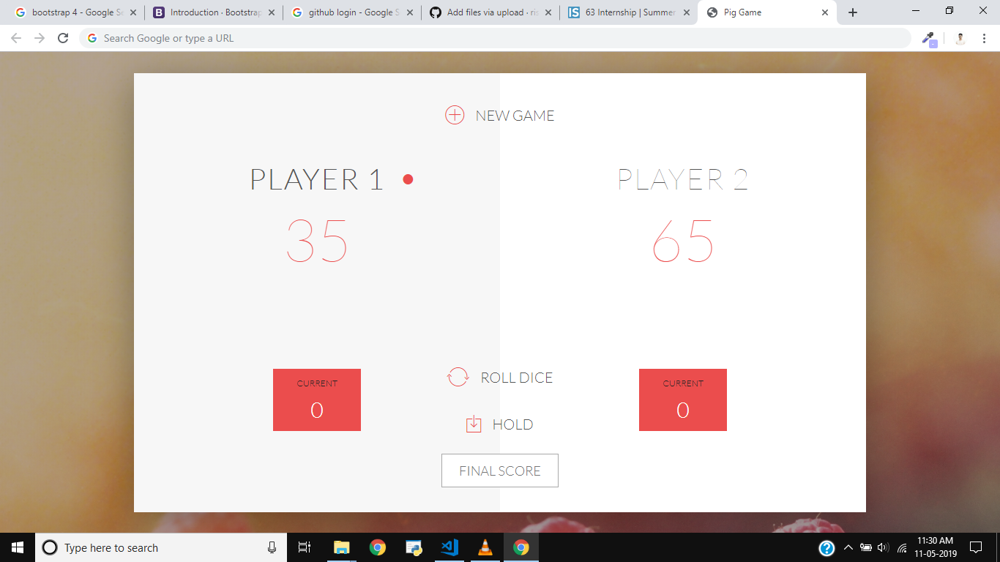
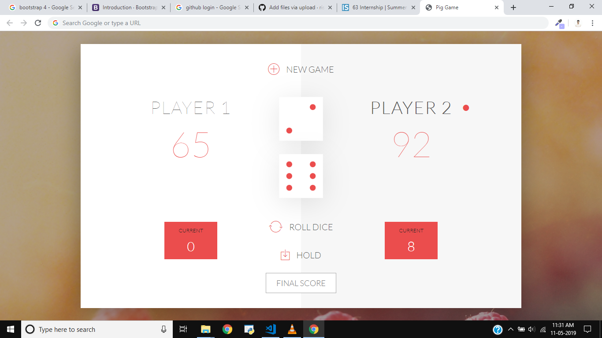
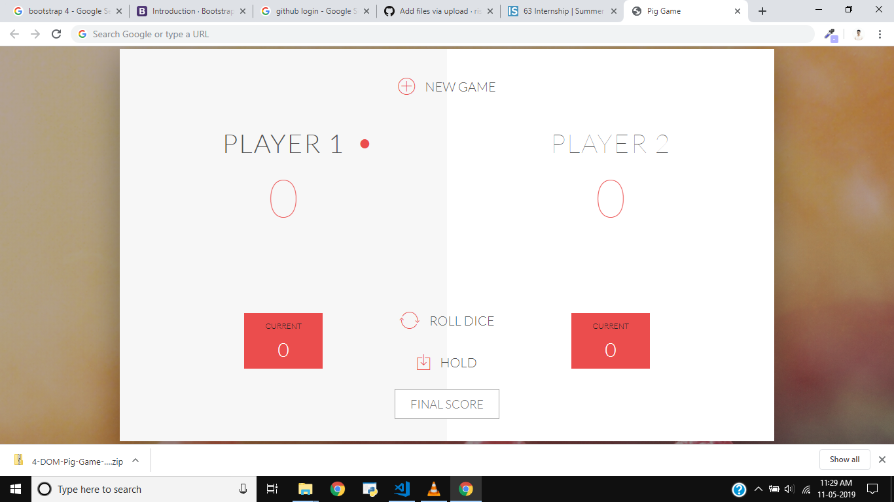

# Dice_Game

Dice Game built using Javascript.

/*
GAME RULES:

- The game has 2 players, playing in rounds
- In each turn, a player rolls a dice as many times as he whishes. Each result get added to his ROUND score
- BUT, if the player rolls a 1, all his ROUND score gets lost. After that, it's the next player's turn
- The player can choose to 'Hold', which means that his ROUND score gets added to his GLBAL score. After that, it's the next player's turn
- The first player to reach 100 points on GLOBAL score wins the game

Upgraded-Rules:
*/
1. A player looses his ENTIRE score when he rolls two 6 in a row. After that, it's the next player's turn. (Hint: Always save the previous dice roll in a separate variable)
2. Add an input field to the HTML where players can set the winning score, so that they can change the predefined score of 100. (Hint: you can read that value with the .value property in JavaScript.)
3. Add another dice to the game, so that there are two dices now. The player looses his current score when one of them is a 1. (Hint: you will need CSS to position the second dice, so take a look at the CSS code for the first one.)

